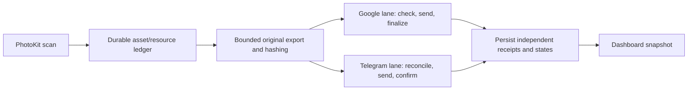

# Cloudified shared handbook 1 — structure and purpose

Updated 2026-10-07. This handbook specifies the target; it does not claim the app
is implemented. Read this and handbook 2 before starting a batch. Read deeper
contracts only for the assigned work.

## Purpose and fixed requirements

Personal sideloadable iOS 26 uploader, Swift 6/SwiftUI. Original photos and videos
to Google Photos using PhotosBackup's implementation and to Telegram using TDLib.
All accessible assets are included by default. Two independent provider switches,
account/channel mapping, silent bounded retries, remote duplicate checks after
reinstall, small error-identification thumbnails, and visible actionable failures.
No demo/mock/seeded records, fake progress or sample logs. Screens use real local/
provider state or explicitly show Not connected/Not scanned/Unavailable. Unknown
counts stay unknown; do not manufacture zero totals for an unread library.
The references supply implementation, not UI inspiration. No full-screen gallery,
editing or playback. Source stays on the Mac; full Xcode builds use manual cloud CI.

## Target directory map and ownership

These application/package paths are planned, not present at this milestone.

| Path | Purpose | Author/owner |
| --- | --- | --- |
| `Cloudified.xcodeproj`, shared `Cloudified` scheme | iOS target and build settings | Builder |
| `App/Application/` | Entry point, composition, scene lifecycle | Builder; architect reviews lifecycle |
| `App/Presentation/Dashboard/` | Overall and separate photo/video/provider status | Builder |
| `App/Presentation/NotUploaded/` | Failures, thumbnails, reasons and retry actions | Builder |
| `App/Presentation/Logs/` | Paginated, redacted diagnostics | Builder |
| `App/Presentation/Settings/` | Account linking/mapping and independent switches | Builder |
| `App/Adapters/PhotoLibrary/` | Resource export, streaming hashes, metadata | Builder; architect reviews |
| `App/Adapters/GooglePhotos/` | Pinned upstream bridge, transport and receipts | Builder; critical changes architect-owned |
| `App/Adapters/Telegram/` | TDLib bridge, documents, manifests/history | Builder; architect reviews bridge ownership |
| `App/Adapters/System/` | Network policy, Keychain, background task wiring | Builder; architect reviews |
| `Packages/CloudifiedCore/Sources/` | Durable queue, retries, receipts, recovery gates, counters and file leases | Architect directly implements |
| `Packages/CloudifiedCore/Sources/Diagnostics/` | Structured persistent events, redaction and diagnostic snapshots | Architect directly implements |
| `Vendor/` and dependency lock/provenance files | Pinned upstream sources/artifact references and licenses | Builder after architect review |
| `scripts/`, `.github/workflows/` | Checks, bounded cloud builds and IPA packaging | Assigned batch owner |
| `docs/01` through `docs/04` | Shared handoff, phases, evidence and reasoning | Architect; log updates coordinated |

Keep core independent of SwiftUI/PhotoKit presentation for clear ownership and
direct code review. No controlled/demo adapters in the app. Build all features
first; the first real app test is P7. Do not invent a large provider-plugin framework.

P1 shell and P2 core are implemented, with static/compiler evidence only. The
[core integration contract](CORE-INTEGRATION.md) maps actual files/public APIs and
defines the P3 source-producer, P4 adapter and P5/P6 composition responsibilities.

## Runtime flow: concurrent destinations

Back Up starts both enabled lanes in the same batch. Each lane independently
chooses ready work, checks remote evidence, transfers and confirms it. Neither
waits for the other's batch to finish. They can handle different assets concurrently.
One preparation worker is a memory/disk limit, not a destination-serialization rule.
Provider-wide restrictions pause that lane only. Shared missing-source errors are
reported accurately as source errors. Never couple the lanes in a fail-fast group.

## Dashboard contract

Dashboard is the first app screen, with a Settings link for missing connections.
Show an overall activity label and explicit provider reasons; status is not just
a green/red dot. Back Up, Pause and Resume are prominent controls.

| Information | Definition |
| --- | --- |
| Overall state | Uploading if an enabled lane is transferring; otherwise specific preparing/checking/finalizing/waiting/paused/complete/attention state |
| Selected total | Exact accessible scan snapshot; permission scope and scan time visible |
| Saved to both | Intersection of confirmed assets at the mapped Google account and Telegram channel |
| Each provider | Connected identity, Enabled/Disabled, current activity/reason, last confirmed upload |
| Remaining | Literal `X remaining out of Y` for each provider's current snapshot |
| Confirmed | `Z saved out of Y`, with uploaded/already-present subtotals in details |
| Current transfer | Filename/type, bytes sent of file size, percentage, current part/component, attempt number |
| Photos section | Total/saved/remaining/failed by provider; Live Photos are a subset |
| Videos section | Its own total/saved/remaining/failed by provider; videos actually queue for both |
| Waiting/failure | Count, known cause, next retry time when available and link to Not uploaded |
| Session detail | Confirmed this session and measured speed/bytes; ETA only when meaningful |

Display `remaining out of selected total`, `confirmed out of selected total`, and
`bytes sent of current resource size (percentage)` using actual snapshots/events.
Provider counts cannot be added or reduced to the smaller saved count to infer
saved-to-both. Formatting descriptions are not seed data or UI preview fixtures.

Asset progress measures confirmed obligations. File percentage measures the current
attempt; 100% bytes changes to Finalizing, not Saved. Resetting a retry's file
percentage must not erase confirmed components. Network bytes, including retries,
are distinct from confirmed original bytes. Unknown sizes/ETA display an honest
unknown state. Live Photo motion files do not inflate standalone video totals.

Top-level navigation: Dashboard, Not uploaded, Logs, Settings. Use native controls,
semantic colors, Dynamic Type and accessible labels. Progress and errors must be
readable without relying on color. No media-browser grid is needed.

## Module boundary rules

Adapters report capability, byte progress, confirmed receipts and classified errors;
they never increment dashboard counts. Core persists receipts before exposing
Saved, scopes every job/receipt to an immutable destination, and owns attempt limits.
Presentation renders immutable snapshots and sends commands. Account switching
cannot redirect an already-started job or credit its receipt to another account.

Original files are staged once where practical; every consumer holds a lease.
Completion of one lane cannot delete bytes still used by the other. Failed/disabled
destinations retain small retry records and can re-export later. Remote reconciliation
is required before sending content whose previous outcome is uncertain.

Diagnostics are a production module built with P2 and instrumented by every adapter,
not an afterthought. The log schema and coverage are specified in handbook 2.
Earlier test-gate proposals in detailed contracts now apply to the first complete
app test/debugging stage, not intermediate development phases.

Detailed contracts: [counters/UI](STATUS-SPEC.md), [reliability](RELIABILITY-SPEC.md),
[resources/networking](RUNTIME-SPEC.md), [build location](BUILD-SETUP.md).
